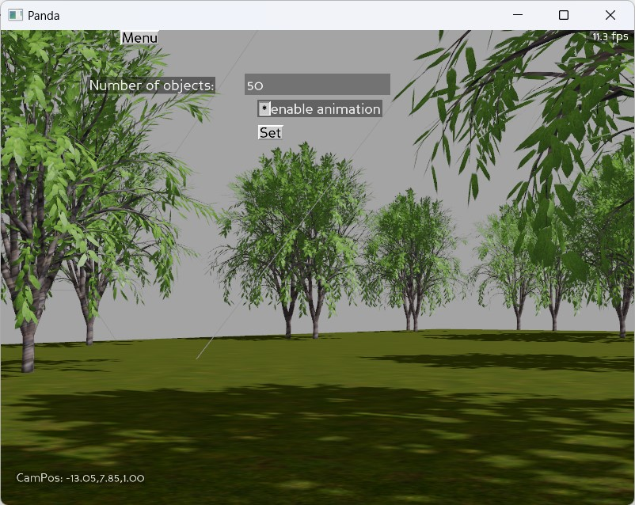

# panda3d animation benchmark
### Run this code and set the number of objects to find out the performance of animations in your machine.

## shortcuts

### mouse controls
right click and drag to view 3d scene

### keyboard shortcuts

w - move forward  
s - move backward  
a - move left  
d - move right    

b - gravity on  
m - to hide all GUI    
