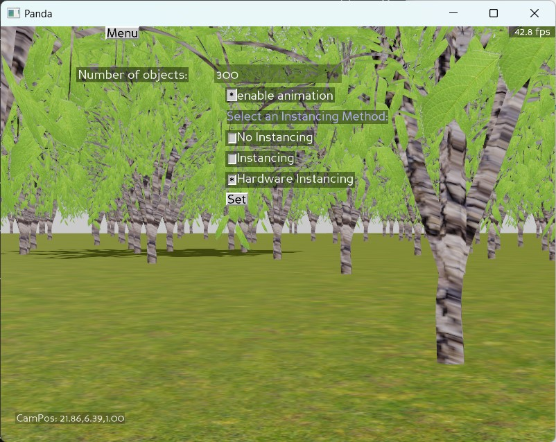

# Panda3D Animation Benchmark
### Run the code. Set the number of objects. Check the FPS.

## Shortcuts

### Mouse controls
right click and drag to view 3d scene

### Keyboard Shortcuts

w - move forward  
s - move backward  
a - move left  
d - move right    

b - gravity on  
m - to hide all GUI    
